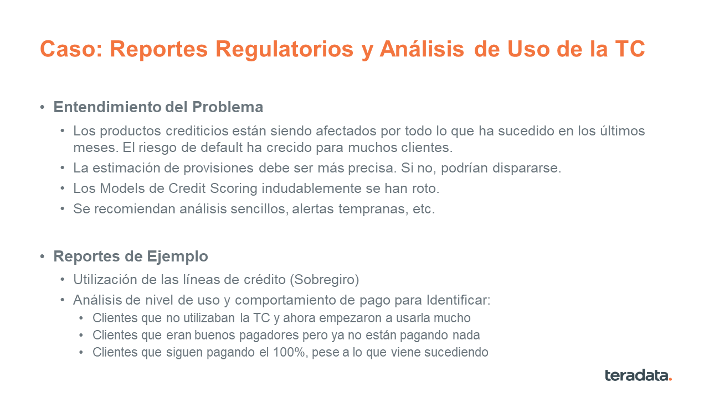
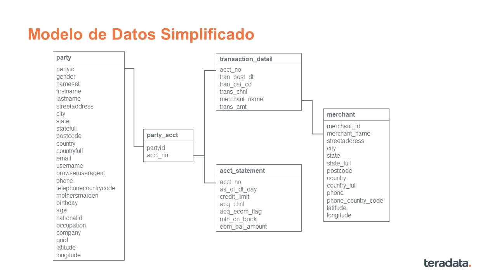

# Demos de Procesamiento In-Database en SAS utilizando Teradata 

En este documento se listan algunos ejemplos para testear la integración entre Teradata y SAS

## Ejemplos con SAS/ACESS

### Business Understanding

### Data Understanding

### Reporte 1: Utilización de la Línea de Crédito

Objetivo: Identificar Clientes Sobregirados

Se utiliza la fuente Account Statements para generar el análisis

Paso 1: Creación de la Libname para conectar Teradata y SAS

~~~
/* Connect to Database */

LIBNAME TD TERADATA DATABASE=td01 SERVER='192.168.100.162' USER='td01' PASSWORD='td01';

/* turn on sql tracing*/

Options sastrace=',,,ds' sastraceloc=saslog nostsuffix;

/*ensure all that can be passed through to TD is actually sent into db*/

Options dbidirectexec;

~~~

Paso 2: Generación de la tabla 'util' con los resultados deseados

~~~
proc sql;
connect to teradata (server='192.168.100.162' user=td01 password=td01);
execute (create multiset table util as (
select acct_no, as_of_dt_day, credit_limit, eom_bal_amount, cast(eom_bal_amount as decimal(8,2))/credit_limit as credit_util 
from acct_statement where credit_util>1.25) with data) by teradata;
execute (commit) by teradata;
quit;
~~~

### Reporte 2: Análisis de Nivel de Uso de la TC

Objetivo: Identificar las principales métricas por cliente

Se combinan Account Statement con Transaction Detail para calcular el nivel de uso

El script para generar la tabla con los resultados esperados, se muestra a continuación:

~~~
proc sql;
connect to teradata (server='192.168.100.162' user=td01 password=td01);
execute (create table td01.account_features as (
select partyid, pa.acct_no, credit_limit, antig, ntrans, sum_trans_amt from party_acct pa 
inner join (select acct_no, credit_limit, count(1) antig from acct_statement group by 1,2) a on pa.acct_no=a.acct_no
inner join (select acct_no, count(1) ntrans, sum(trans_amt) sum_trans_amt from transaction_detail group by 1) t on pa.acct_no=t.acct_no) 
with data) by teradata;
execute (commit) by teradata;
quit;
~~~

### Reporte 3: Análisis de Comportamiento de Pagos

Objetivo: Identificar nuevos segmentos de clientes

Se utiliza la fuente Transaction Detail para generar el análisis

El script para generar la tabla con los resultados esperados, se muestra a continuación:

~~~
proc sql;
connect to teradata (server='192.168.100.162' user=td01 password=td01);
execute (create table td01.pagos as (
select t.acct_no, mesc, compra_amt, pago_amt, cast(pago_amt as decimal(8,2))/compra_amt ratio 
from 
   (select acct_no, year(tran_post_dt)*100+month(tran_post_dt) mesc, sum(trans_amt) as compra_amt 
   from transaction_detail where tran_cat_cd=1 group by 1,2) as t
inner join 
   (select acct_no, year(tran_post_dt)*100+month(tran_post_dt) mesp, sum(-trans_amt) as pago_amt 
   from transaction_detail where tran_cat_cd=19 and trans_amt<0 group by 1,2) as p 
   on t.acct_no=p.acct_no and mesc=mesp
) with data) by teradata;
execute (commit) by teradata;
quit;
~~~

## Ejemplos con DS2

Objetivo: Calcular una columna que sea la suma de varias otras

Se utiliza la tabla 'rand' que ha sido creada utilizando las funciones de generación de datos aleatorios en Teradata:

~~~
create table td01.rand as (
SELECT RANDOM(1,10000) AS id
, CAST(RANDOM(0,99999) AS decimal(9,4))/99999 v1
, CAST(RANDOM(0,99999) AS decimal(9,4))/99999 v2
, CAST(RANDOM(0,99999) AS decimal(9,4))/99999 v3
, CAST(RANDOM(0,99999) AS decimal(9,4))/99999 v4
, CAST(RANDOM(0,99999) AS decimal(9,4))/99999 v5
, CAST(RANDOM(0,99999) AS decimal(9,4))/99999 v6
, CAST(RANDOM(0,99999) AS decimal(9,4))/99999 v7
, CAST(RANDOM(0,99999) AS decimal(9,4))/99999 v8
, CAST(RANDOM(0,99999) AS decimal(9,4))/99999 v9
, CAST(RANDOM(0,99999) AS decimal(9,4))/99999 v10
, CAST(RANDOM(0,99999) AS decimal(9,4))/99999 v11
, CAST(RANDOM(0,99999) AS decimal(9,4))/99999 v12
, CAST(RANDOM(0,99999) AS decimal(9,4))/99999 v13
, CAST(RANDOM(0,99999) AS decimal(9,4))/99999 v14
, CAST(RANDOM(0,99999) AS decimal(9,4))/99999 v15
, CAST(RANDOM(0,99999) AS decimal(9,4))/99999 v16
, CAST(RANDOM(0,99999) AS decimal(9,4))/99999 v17
, CAST(RANDOM(0,99999) AS decimal(9,4))/99999 v18
, CAST(RANDOM(0,99999) AS decimal(9,4))/99999 v19
, CAST(RANDOM(0,99999) AS decimal(9,4))/99999 v20
, CAST(RANDOM(0,99999) AS decimal(9,4))/99999 v21
, CAST(RANDOM(0,99999) AS decimal(9,4))/99999 v22
, CAST(RANDOM(0,99999) AS decimal(9,4))/99999 v23
, CAST(RANDOM(0,99999) AS decimal(9,4))/99999 v24
, CAST(RANDOM(0,99999) AS decimal(9,4))/99999 v25
FROM (select top 1000 * from sys_calendar.CALENDAR) as f
) with data;
~~~

Paso 1: Creación de la Libname para conectar Teradata y SAS

~~~
LIBNAME TD TERADATA DATABASE=td01 SERVER='192.168.100.162' USER='td01' PASSWORD='td01';
Options sastrace=',,,ds' sastraceloc=saslog nostsuffix dbidirectexec;
~~~

Paso 2: Script DS2 para ejecutar el proceso

~~~
proc ds2 DS2ACCEL=YES;
thread compute;
  method run();
    set td.rand;
    total = sum(v1, ., ., v25);
  end;
endthread;
run;

data td.totals;
  dcl thread compute t;
  method run();
    set from t;
  end;
enddata;
run;
quit;
~~~

Copyright 2020 Teradata. All rights reserved.
